## **Cy**tometry **C**luster **A**nnotation and **D**ifferential **A**bundance **S**uite

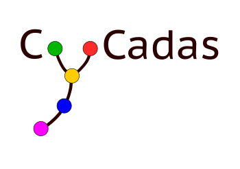

#### Efficient and reproducible annotation of cytometry data

**Aims**:

• facilitating the process of cluster annotation while reducing user bias,

• saving time required to perform the annotation in comparison to manual methods,

• improving reproducibility.

**Key features**:

• defining the threshold of positive/negative marker expression,

• interactive inspection of cluster phenotypes,

• automatic merging of populations,

• differential abundance analysis.

## **Workspace:**

The **Workspace** section manages all data imports required to start or resume an annotation process.\

The required files depend on the **source of input data**.

-   **GigaSOM / FlowSOM** clustering data

    To start a new annotation process, the following files are required

    -   **Median marker expression table** (cluster × marker)

    -   **Cluster frequency table** (cluster counts per sample or condition)

    **Optional** files (highlighted as *orange boxes* in the UI):

    -   Marker threshold - holding custom defined threshold values per marker

    -   Annotation tree - from a previous annotation process

    -   Metadata - for statistical analysis

    -   Cluster count table - for statistical analysis

Code examples for generating these files from GigaSOM or FlowSOM workflows are available on GitHub.

-   **Catalyst data**

    CyCadas can also be initialized using output from **CATALYST**.

-   **RemosteSOM data**

    CyCadas natively supports JSON outputs from RemoteSOM.

### Saving CyCadas Workspace:

During the annotation process, all data and user-defined settings can be **saved to a CyCadas workspace file (`.rds`)**.

This includes:

-   Thresholds

-   Annotation tree

-   Metadata

-   Marker expression data

-   UMAP coordinates (if computed)

-   Counts tables

-   RemoteSOM and Catalyst data (if loaded)

The saved workspace can be reloaded at any time to continue the annotation exactly where it was left off.

### Demo dataset:

To enable tool exploration, we provide the demo dataset that can be loaded (**Load** tab → **Demo Data**) either as cluster expression data only (**Load Cluster Expression Demo Data**, allowing the user to create the annotation) or as annotated data (**Load Annotated Demo Data** which include the annotation tree).

*This demo dataset is generated from the publicly available mass cytometry data of patients with idiopathic Parkinson’s disease and healthy controls (Capelle, C.M. et al., Nat Commun, 2023) that were clustered with GigaSOM to generate 1600 clusters.*

### Input data

All the data tables loaded into CyCadas are uploaded in the **Load** tab → **Required**. The tool requires output of the clustering algorithm in the form of 2 data tables:

• marker expression (mean or median expression of each marker in each cluster),

• cluster frequency (proportion of each cluster within the dataset).

Coding examples enabling the extraction of these files from the clustering algorithm workflow are available on Github.

Additionally, if performing differential abundance analysis is desired, 2 additional tables can be uploaded (**Load** → **Optional**):

• metadata table,

• count table (of every cluster in each sample).

If the analysis is being continued, the threshold values and annotation tree can be exported from CyCadas (see: **Data export** below) and uploaded into the software.

### Explore Data:

In this Section the User can explore UMAP Marker expression of the selected marker across all the clusters.

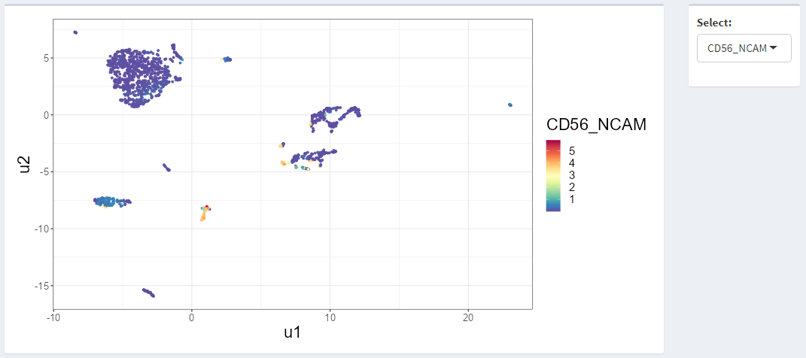

Below the User can select a Area of the UMAP (left)and preview the marker expression in a Heatmap (right)

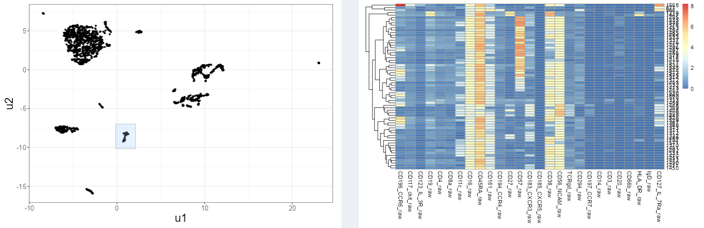

### Thresholds

In the **Thresholds** tab, the estimation of threshold value defining negative and positive marker expression of each marker is based on 1-dimensional k-means clustering. The bimodality for every marker is assessed and the bimodal coefficient values are reported. The blue threshold line indicates that data meets the bimodal distribution criteria, otherwise it is colored red. The threshold value can be manually adjusted by clicking on the scatterplot.

*Expression of CD8a with blue threshold line indicating the bimodal distribution:*

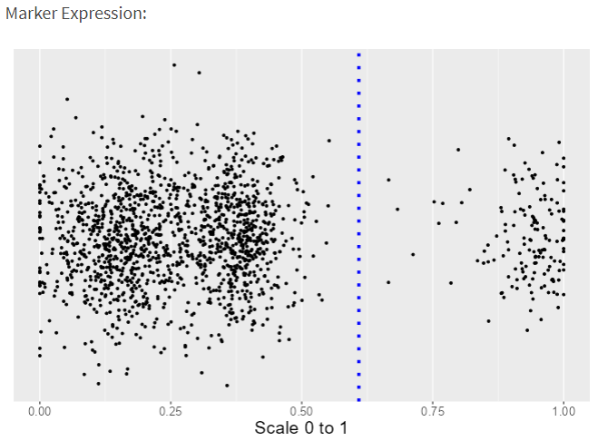

*Expression of TCRgd with red threshold line indicating that this marker expression does not follow the bimodal distribution:*

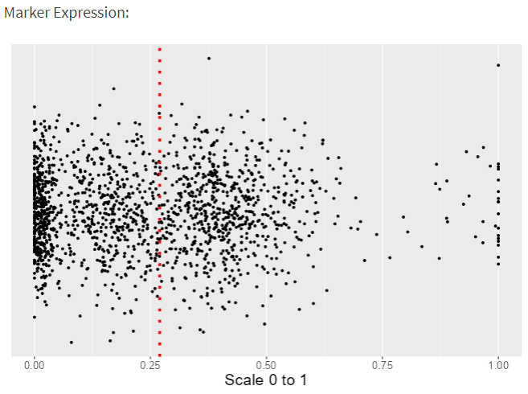

### Annotation

The **Annotation** tab allows performing the annotation in a tree-based hierarchical process - initially, the main cell types are defined, followed by the identification of their subtypes (with the level of detail defined by the user).

All the clusters are initially defined as "unassigned". Then, upon the selection of positive and negative markers defining the population, clusters characterized by given expression pattern are re-assigned from the parent node to the child node.

*Scheme depicting the process of building the annotation tree:*

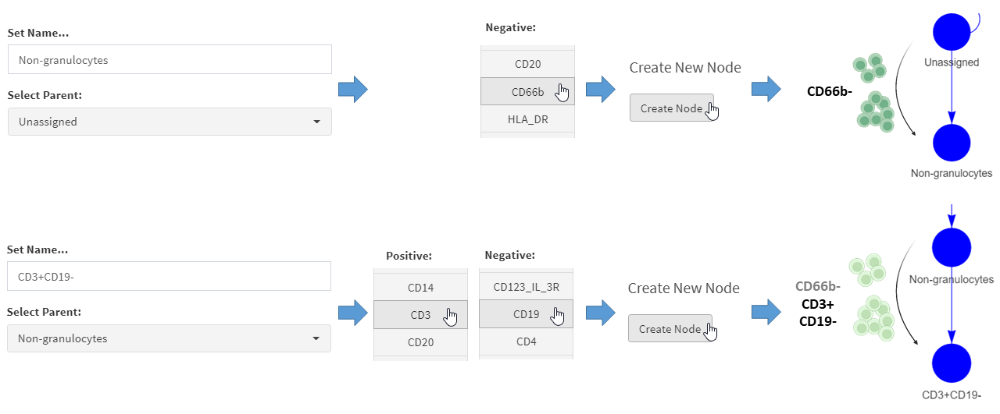

*Cropped fragment of the completed annotation tree:*

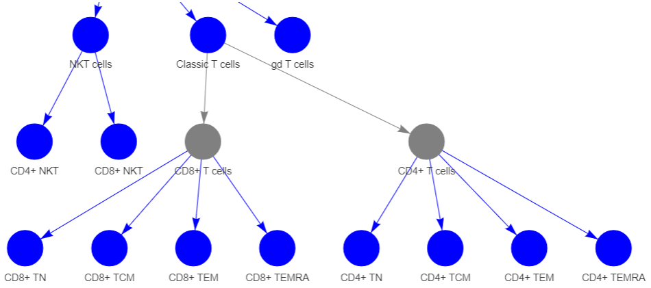

Upon selection of the node, heatmap displaying the expression of all the markers in all the clusters belonging to this node is shown.

*Heatmap depicting phenotype of clusters annotated as CD8+ TEM cells:*

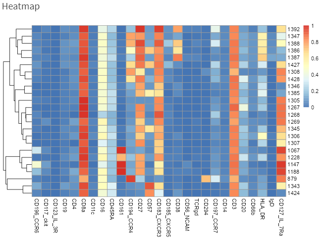

### Differential abundance analysis

In the **Differential Abundance** tab, a pairwise Wilcoxon test on all the nodes is performed upon selecting the desired multiple testing correction method:

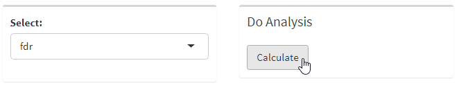

**DA Interactive Tree** allows exploration of abundance of all the defined subpopulations across the conditions by selecting the node on the annotation tree.

*Upon clicking on the desired node...*

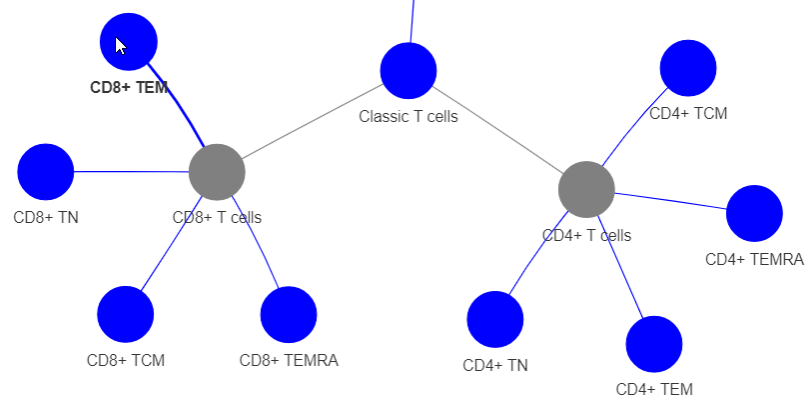

*... proportion of the selected celltype across the condition is plotted.*

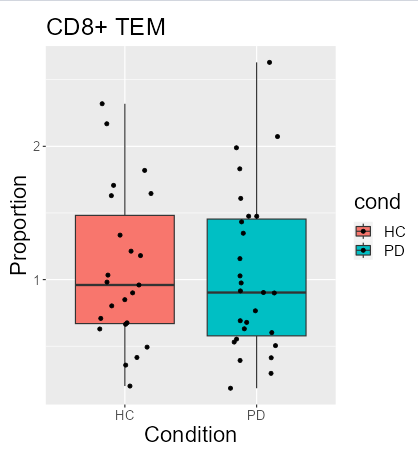

### Data export

Differential abundance analysis results, as well as proportion table (% of defined cell populations across all the samples) can be exported in the **Differential Abundance** tab.

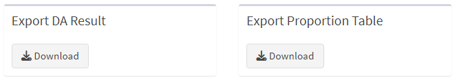

Files enabling the continuation of the analysis - modified threshold values, as well as annotation tree structure, can be exported from the **Thresholds** and **Annotation** tabs, respectively, and re-loaded (**Load** tab) to continue the analysis.

*Exporting annotation tree:*

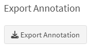

*Exporting threshold values:*

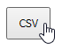
