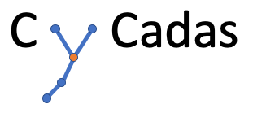

# cycadas

### ToRun:
pkgload::load_all(".")

cycadas()
=======


## Cytometry Cluster Annotation and Differential Abundance Suite

#### Efficient and reproducible cytometry data

Aims:

• facilitating the process of cluster annotation while reducing user bias • improving reproducibility

Key features:

• defining the threshold of positive/negative marker expression

• interactive inspection of cluster phenotypes

• automatic merging of populations

• differential abundance analysis

## Installation Instructions

To run:

-   Checkout branch develop

``` r
library(devtools)

# load all required packages
pkgload::load_all(".")

# start the cycadas shiny app
cycadas()
```

## Working with CyCadas

### Starting a new project and exploring data:

**CyCadas** requires two CSV files being an output of clustering algorithm -- 1) median expression of markers in the clusters and 2) frequency of each cluster (Load -- Required). To have a first look on the data, explore the UMAP interactive and UMAP Marker expression tabs. In UMAP interactive tab, select the desired part of the UMAP to visualise marker expression in selected clusters on the heatmap. In the UMAP Marker expression, select the marker of interest to evaluate its expression in all the clusters.

### Selecting threshold for each marker:

As the cluster annotation (phenotype definition) relies on a defined set of negative/positive markers, each marker should follow a bi-modal distribution. An initial separation (threshold) between positve (high) and negative (low) expression is estimated after uploading the data-set and indicated by a blue vertical line in the scatter plot and histogram. If a marker doesn't show a bimodal distribution, it is marked with a red line. In such cases the adjustments have to be made manually, or this marker should be re-considered as phenotypic marker.

The threshold value can be adjusted by clicking at the desired position within the scatter plot. In such cases any already defined annotation is automatically re-calculated.

Threshold settings can be exported as csv and re-used by loading.

### Annotation

Select the desired combination of positive and negative markers in the rolling menu. The classification of the clusters as negative or positive for a specific marker is occurring based on the threshold values set in the Thresholds tab. Clusters characterised by the defined (negative/positive) expression for the chosen markers are then selected, and:

• heatmap displays normalized expression of all the markers in the selected clusters, • UMAP represents all the clusters, with the selected clusters being highlighted in blue.

A new node containing clusters characterised by a selected phenotype will be generated.

Annotation is a hierarchical process, where desired sub-populations can be differentiated from the main cell phenotypes.

### Differential abundance analysis

Upon uploading: • metadata table (defining the condition of each sample, for example patient vs healthy), • proportion table (defining the cluster composition of each sample), differential abundance analysis (comparing cellular composition in samples of different conditions) is performed (pairwise Wilcoxon test). Multiple testing correction methods (Bonferroni, Hochberg, FDR, among others) can be selected.

### Demo dataset

CyCadas includes two versions of a dataset for demonstration purpose. Version 1 includes median expression and cluster frequencies but no annotation has been performaed yet. Version two includes the fully annotated dataset for exploration and differential abundance.     

## Prepare the Data input
### Median Expression and Cluster Frequencies from FlowSOM (R Code):

``` r
# within your clustering workflow create sample_ids according to the metadata files:

sample_ids <- rep(metadata$sample_id, fsApply(fcs, nrow))

library(FlowSOM)
fsom <- ReadInput(fcs, transform = FALSE, scale = FALSE)

set.seed(42)
som <- BuildSOM(fsom, colsToUse = lineage_markers, xdim=20, ydim=20, rlen=40)

expr_median <- som$map$medianValues

# Calculate cluster frequencies
clustering_table <- as.numeric(table(som$map$mapping[,1]))
clustering_prop <- round(clustering_table / sum(clustering_table) * 100, 2)
df_prop <- as.data.frame(clustering_prop)
df_prop$cluster <- rownames(df_prop)

write.csv(expr_median, "expr_median.csv", row.names = F)
write.csv(df_prop, "cluster_freq.csv")

## ----------------------------------------------------------------------------
## Generate the Proportion Table
## ----------------------------------------------------------------------------
counts_table <- table(som$map$mapping[,1], sample_ids)
props_table <- t(t(counts_table) / colSums(counts_table)) * 100

props <- as.data.frame.matrix(props_table)

write.csv(props, "proportion_table.csv")
```

### Median Expression and Cluster Frequencies from GigaSOM (Julia Code):

``` julia
Random.seed!(42)

som = initGigaSOM(di, gridSize, gridSize, seed = 13) # set a seed value
som = trainGigaSOM(som, di, epochs = nEpochs)

mapping_di = mapToGigaSOM(som, di)
mapping = gather_array(mapping_di)

# get the cluster frequencies
clusterFreq = dcount(mc, mapping_di)
df = DataFrame(column_name = clusterFreq)
CSV.write("cluster_freq_$mc.csv", df)

files = distributeFCSFileVector(:fileIDs, md[:, :file_name])

# Get the count table per fileID
count_tbl = dcount_buckets(mc, mapping_di, size(md, 1), files)
ct = DataFrame(count_tbl, :auto)
# ct = convert(DataFrame, count_tbl)
rename!(ct, md.sample_id)
# export the count talbe
CSV.write("cluster_counts_$mc.csv", ct)

# Get the median expression per cluster
expr_tbl = dmedian_buckets(di, mc, mapping_di, cols)

et  = DataFrame(expr_tbl, :auto)
rename!(et, lineage_markers)

# export median marker expression
CSV.write("median_expr_$mc.csv", et)
```

Detailed workflow for each method can be found in the data section.
